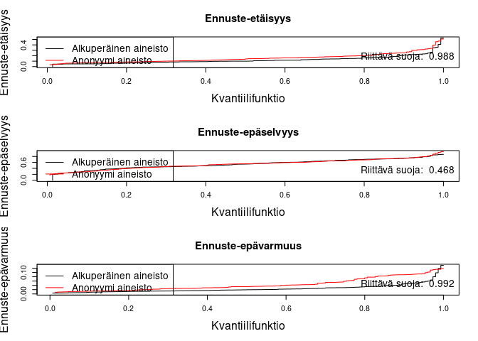

README
================

These tools are based on my thesis that is available for free on:

https://www.utupub.fi/handle/10024/177844

# anon

A library containing data anonymization tools for R.

## 1. Installation

    # 1. Install "devtools" package on R
        install.packages("devtools")

    # 2. Install the "anon" package on R
        devtools::install_github("rajalah71/anon") # or /anon@paketti

``` r
# 3. Load the "anon" library
    library(anon)
```

## 2. Usage

The package contains 4 functions to anonymize your data: $k$-anonymity,
$l$-diversity, RSA encryption and spectral anonymization with 2 helper
functions provided.

The package also contains functions to measure the success of the
anonymization on three levels: privacy, utility and similarity.

### 2.1 *k*-anonymity

``` r
data("iris")

kanon = kAnon(iris, k=5, quasiIdentifiers = c("Sepal.Length", "Sepal.Width", "Petal.Length", "Petal.Width", "Species"))[1:10, ]
```

``` r
kanon
```

    ##    Sepal.Length Sepal.Width Petal.Length Petal.Width Species
    ## 1      4.844000    3.248000       1.3840      0.1880  setosa
    ## 2      4.844000    3.248000       1.3840      0.1880  setosa
    ## 3      4.844000    3.248000       1.3840      0.1880  setosa
    ## 4      4.844000    3.248000       1.3840      0.1880  setosa
    ## 5      4.844000    3.248000       1.3840      0.1880  setosa
    ## 6      5.143750    3.537500       1.5625      0.3625  setosa
    ## 7      5.143750    3.537500       1.5625      0.3625  setosa
    ## 8      5.211111    3.733333       1.5000      0.2000  setosa
    ## 9      4.844000    3.248000       1.3840      0.1880  setosa
    ## 10     4.844000    3.248000       1.3840      0.1880  setosa

- This uses all columns as quasi identifiers by default and operates on
  them with mean on numeric columns and with mode on categorical ones.

- You can define your own generalization functions and on what columns
  the function will operate on. These functions must be on a list with
  item names matching the names of the quasi-identifier columns. The
  columns will be worked on the order you name them, or by cardinality
  on descending order if left unnamed.

### 2.2 *l*-diversity

``` r
ldiv = lDiversity(iris, sensitiveAttributes = "Species", quasiIdentifiers = c("Sepal.Length", "Sepal.Width", "Petal.Length", "Petal.Width"), l=2)[1:10, ] 
```

``` r
ldiv
```

    ##    Sepal.Length Sepal.Width Petal.Length Petal.Width Species
    ## 1      5.036538         3.4     1.601923   0.3096154  setosa
    ## 2      5.036538         3.4     1.601923   0.3096154  setosa
    ## 3      5.036538         3.4     1.601923   0.3096154  setosa
    ## 4      5.036538         3.4     1.601923   0.3096154  setosa
    ## 5      5.036538         3.4     1.601923   0.3096154  setosa
    ## 6      5.036538         3.4     1.601923   0.3096154  setosa
    ## 7      5.036538         3.4     1.601923   0.3096154  setosa
    ## 8      5.036538         3.4     1.601923   0.3096154  setosa
    ## 9      5.036538         3.4     1.601923   0.3096154  setosa
    ## 10     5.036538         3.4     1.601923   0.3096154  setosa

- Works similiarly to kAnon, you just need to specify the sensitive
  attribute(s). If your data has multiple sensitive attributes with too
  high cardinality, one can use the ‘sensitive_generalizer’ function to
  reduce the cardinality of those variables. This, however, will
  negatively impact the utility of the data.

### 2.3 RSA

``` r
rsa = encrypt(iris)[1:10, ]
```

``` r
rsa
```

    ##    Sepal.Length Sepal.Width Petal.Length Petal.Width Species
    ## 1     0.5062727  0.85605128    0.1306362  0.95801477       0
    ## 2     0.4924734  0.11105757    0.1306362  0.95801477       0
    ## 3     0.1035438  0.21286712    0.3367670  0.95801477       0
    ## 4     0.1131051  0.06792302    0.2303505  0.95801477       0
    ## 5     0.1469582  0.97099976    0.1306362  0.95801477       0
    ## 6     0.1432559  0.67730414    0.7074619  1.00000000       0
    ## 7     0.1131051  0.01329477    0.1306362  0.06332291       0
    ## 8     0.1469582  0.01329477    0.2303505  0.95801477       0
    ## 9     0.2352112  0.94542718    0.1306362  0.95801477       0
    ## 10    0.4924734  0.06792302    0.2303505  0.71684865       0

- Encrypts the data using a new RSA key = 2048 bits by default. Do not
  distribute the public key.

### 2.4 Spectral anonymization

    # General usage:
    spectral(iris, your_anon_function, on_matrices = "U")

- Anonymizes data on the spectral basis provided by SVD, $M = UDV'$.
  Supports any anonymization function
  $f: R^{a \times b} \to R^{a \times b}$. In this package, helper
  functions ‘cell_swap’ and ‘sensitive_noise’ are provided for
  permutations and additive noise respectively.

``` r
# Example usage, spectral permutation:
# Performs column permutations on each column of the matrix U
swap = spectral(iris, cell_swap, on_matrices = "U")
```

``` r
swap[1:10, ]
```

    ##    Sepal.Length Sepal.Width Petal.Length Petal.Width    Species
    ## 1      5.906487    2.375044     5.527025   2.1438910  virginica
    ## 2      5.847684    2.546313     4.365635   1.5204523 versicolor
    ## 3      5.306746    2.705059     4.028581   1.3372955  virginica
    ## 4      5.979122    3.195010     4.241218   1.3209798  virginica
    ## 5      5.026914    3.566041     1.349429   0.2506105     setosa
    ## 6      6.269000    2.947778     3.900450   1.5309855  virginica
    ## 7      7.114459    3.143902     5.825558   1.3976396 versicolor
    ## 8      6.035461    2.587460     5.519373   1.9293927 versicolor
    ## 9      6.238483    1.997127     5.770913   2.0936210 versicolor
    ## 10     4.918707    3.244483     1.459265   0.1719687     setosa

``` r
# Example usage spectral noise:
# Adds random noise on the columns of the matrix UD
noise = spectral(iris, sensitive_noise, on_matrices = "UD")
```

``` r
noise[1:10, ]
```

    ##    Sepal.Length Sepal.Width Petal.Length Petal.Width   Species
    ## 1      5.337824   2.8861675    5.1825368   3.4646994 virginica
    ## 2      7.791283  -0.2818075    4.9768479  -0.5521176 virginica
    ## 3     -2.445947   2.9421279   -1.6576780   1.4666112 virginica
    ## 4      5.748367   7.0424958   -1.8629956   4.4918546    setosa
    ## 5      1.315619   4.8930406  -10.1622020  -5.1917895    setosa
    ## 6      3.664768   3.1356003    2.2826870   1.5216045 virginica
    ## 7      4.229952   4.9171275   -0.4297981  -0.8479759    setosa
    ## 8      6.889078  -0.3392106   11.2470468   5.7660687 virginica
    ## 9      3.476335  -2.5037215    9.0381173   4.8878416 virginica
    ## 10     4.459015   2.6773951    8.0109034   3.1565152 virginica

## 3. Privacy

``` r
# Re-identification rate
ri_rates = reidentification_rate(list("original" = iris, "anon" = swap), quasiIdentifiers = c("Sepal.Length", "Sepal.Width", "Petal.Length", "Petal.Width", "Species"))

lapply(ri_rates, median)
```

    ## $original
    ## [1] 0.9933333
    ## 
    ## $anon
    ## [1] 0.006666667

- The re-identification rate has dropped significantly after the
  anonymization.

``` r
prediction_plot(iris, k=5, swap)
```

<!-- -->

## 4. Utility and similarity

- Also check the utility (performance on a model of interest, for
  example) and similarity (of means and variances, for example) of the
  anonymized data against those of the original data.

``` r
# Utility
trainIndices = sample(c(TRUE,FALSE), nrow(iris), replace = TRUE, prob = c(0.7, 0.3))
train = iris[trainIndices, ]
test = iris[!trainIndices, ]
anon_train = spectral(train, sensitive_noise, on_matrices = "UD")

lm = lm(Sepal.Length ~ Sepal.Width + Petal.Length + Petal.Width + Species, data = train)
lm_anon = lm(Sepal.Length ~ Sepal.Width + Petal.Length + Petal.Width + Species, data = anon_train)
testRsquared_multimodel(list("Original" = lm, "Anon" = lm_anon), test, response = "Sepal.Length")
```

    ##      names      results            
    ## [1,] "Original" "0.866588998862304"
    ## [2,] "Anon"     "0.799721276792281"

- The coefficient of determination on test data has dropped after the
  anonymization, meaning that the utility of the data has dropped.

``` r
# Similarity
mediansAll(list("Original" = iris, "Anon" = swap))
```

    ## [1] "Means:"
    ## $Medians
    ##          Anon 
    ## -8.658583e-17 
    ## 
    ## $MADs
    ##         Anon 
    ## 1.843057e-16 
    ## 
    ## [1] "Vars:"
    ## $Medians
    ##       Anon 
    ## 0.01042568 
    ## 
    ## $MADs
    ##        Anon 
    ## 0.009326122 
    ## 
    ## [1] "Cors:"
    ## $Medians
    ##       Anon 
    ## 0.02565579 
    ## 
    ## $MADs
    ##       Anon 
    ## 0.01554227

- The means, variances and correlations have changed after the
  anonymization.
