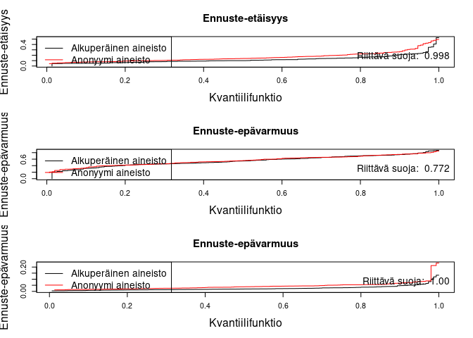

README
================

# anon

A package containing data anonymization tools for R.

## 1. Installation

    # 1. Install "devtools" package on R
        install.packages("devtools")

    # 2. Install the "anon" package on R
        devtools::install_github("rajalah71/anon") # or /anon@paketti

``` r
# 3. Load the "anon" library
    library(anon)
```

## 2. Usage

The package contains 4 functions to anonymize your data: $k$-anonymity,
$l$-diversity, RSA encryption and spectral anonymization.

The package also contains functions to measure the success of the
anonymization on three levels: privacy, utility and similarity.

### 2.1 *k*-anonymity

``` r
data("iris")

kAnon(iris, k=5, quasiIdentifiers = c("Sepal.Length", "Sepal.Width", "Petal.Length", "Petal.Width", "Species"))[1:10, ]
```

    ## Warning in kAnon(iris, k = 5, quasiIdentifiers = c("Sepal.Length", "Sepal.Width", : Shuffle is FALSE. Use 'anon::shuffle()' before publishing data.

    ## Iterating over all subsets: 149  iterations at most. 
    ## Iteration: 1 / 149 Iteration: 2 / 149 Iteration: 3 / 149 Iteration: 4 / 149 Iteration: 5 / 149 Iteration: 6 / 149 Iteration: 7 / 149 Iteration: 8 / 149 Iteration: 9 / 149 Iteration: 10 / 149 Iteration: 11 / 149 Iteration: 12 / 149 Iteration: 13 / 149 Iteration: 14 / 149 Iteration: 15 / 149 Iteration: 16 / 149 Iteration: 17 / 149 Iteration: 18 / 149 Iteration: 19 / 149 Iteration: 20 / 149 Iteration: 21 / 149 Iteration: 22 / 149 Iteration: 23 / 149 Iteration: 24 / 149 Iteration: 25 / 149 Iteration: 26 / 149 Iteration: 27 / 149 Iteration: 28 / 149 Iteration: 29 / 149 Iteration: 30 / 149 Iteration: 31 / 149 Iteration: 32 / 149 Iteration: 33 / 149 Iteration: 34 / 149 Iteration: 35 / 149 Iteration: 36 / 149 Iteration: 37 / 149 Iteration: 38 / 149 Iteration: 39 / 149 Iteration: 40 / 149 Iteration: 41 / 149 Iteration: 42 / 149 Iteration: 43 / 149 Iteration: 44 / 149 Iteration: 45 / 149 Iteration: 46 / 149 Iteration: 47 / 149 Iteration: 48 / 149 Iteration: 49 / 149 Iteration: 50 / 149 Iteration: 51 / 149 Iteration: 52 / 149 Iteration: 53 / 149 Iteration: 54 / 149 Iteration: 55 / 149 Iteration: 56 / 149 Iteration: 57 / 149 Iteration: 58 / 149 Time difference of 51.30738 secs

    ##    Sepal.Length Sepal.Width Petal.Length Petal.Width Species
    ## 1      4.844000    3.248000       1.3840      0.1880  setosa
    ## 2      4.844000    3.248000       1.3840      0.1880  setosa
    ## 3      4.844000    3.248000       1.3840      0.1880  setosa
    ## 4      4.844000    3.248000       1.3840      0.1880  setosa
    ## 5      4.844000    3.248000       1.3840      0.1880  setosa
    ## 6      5.143750    3.537500       1.5625      0.3625  setosa
    ## 7      5.143750    3.537500       1.5625      0.3625  setosa
    ## 8      5.211111    3.733333       1.5000      0.2000  setosa
    ## 9      4.844000    3.248000       1.3840      0.1880  setosa
    ## 10     4.844000    3.248000       1.3840      0.1880  setosa

- This uses all columns as quasi identifiers by default and operates on
  them with mean on numeric columns and with mode on categorical ones.

- You can define your own generalization functions and on what columns
  the function will operate on. Functions must be on a named list which
  names match the names of the quasi identifier columns. The columns
  will be worked on the order you name them, or by cardinality if left
  unnamed.

### 2.2 *l*-diversity

``` r
lDiversity(iris, sensitiveAttributes = "Species", quasiIdentifiers = c("Sepal.Length", "Sepal.Width", "Petal.Length", "Petal.Width"), l=2)[1:10, ] 
```

    ## Warning in lDiversity(iris, sensitiveAttributes = "Species", quasiIdentifiers = c("Sepal.Length", : Shuffle is FALSE. Use 'anon::shuffle()' before publishing data.

    ## Iterating over all subsets: 149  iterations at most. 
    ## Iteration: 1 / 149 Iteration: 2 / 149 Iteration: 3 / 149 Iteration: 4 / 149 Iteration: 5 / 149 Iteration: 6 / 149 Iteration: 7 / 149 Iteration: 8 / 149 Iteration: 9 / 149 Iteration: 10 / 149 Iteration: 11 / 149 Iteration: 12 / 149 Iteration: 13 / 149 Iteration: 14 / 149 Iteration: 15 / 149 Iteration: 16 / 149 Iteration: 17 / 149 Iteration: 18 / 149 Iteration: 19 / 149 Iteration: 20 / 149 Iteration: 21 / 149 Iteration: 22 / 149 Iteration: 23 / 149 Iteration: 24 / 149 Iteration: 25 / 149 Iteration: 26 / 149 Iteration: 27 / 149 Time difference of 45.33956 secs

    ##    Sepal.Length Sepal.Width Petal.Length Petal.Width Species
    ## 1      5.036538         3.4     1.601923   0.3096154  setosa
    ## 2      5.036538         3.4     1.601923   0.3096154  setosa
    ## 3      5.036538         3.4     1.601923   0.3096154  setosa
    ## 4      5.036538         3.4     1.601923   0.3096154  setosa
    ## 5      5.036538         3.4     1.601923   0.3096154  setosa
    ## 6      5.036538         3.4     1.601923   0.3096154  setosa
    ## 7      5.036538         3.4     1.601923   0.3096154  setosa
    ## 8      5.036538         3.4     1.601923   0.3096154  setosa
    ## 9      5.036538         3.4     1.601923   0.3096154  setosa
    ## 10     5.036538         3.4     1.601923   0.3096154  setosa

- Works similiarly to kAnon, just need to specify the sensitive
  attributes. Won’t probably work with more than one of them.

### 2.3 RSA

``` r
encrypt(iris)[1:10, ]
```

    ## Warning in encrypt(iris): Shuffle is FALSE. Use 'anon::shuffle()' before publishing data.

    ## Information loss on conversion to double: 0

    ##    Sepal.Length Sepal.Width Petal.Length Petal.Width           Species
    ## 1    0.88580216  0.47405943  0.129315214   0.5354969 0.729958818736627
    ## 2    0.04775173  0.39176134  0.129315214   0.5354969 0.729958818736627
    ## 3    0.72129994  0.61859581  0.352256403   0.5354969 0.729958818736627
    ## 4    0.17876804  0.06733691  0.149103867   0.5354969 0.729958818736627
    ## 5    0.20919544  0.48323221  0.129315214   0.5354969 0.729958818736627
    ## 6    0.63935028  0.30551380  0.004095104   0.8245290 0.729958818736627
    ## 7    0.17876804  0.08313969  0.129315214   0.4413214 0.729958818736627
    ## 8    0.20919544  0.08313969  0.149103867   0.5354969 0.729958818736627
    ## 9    0.21362184  0.51609466  0.129315214   0.5354969 0.729958818736627
    ## 10   0.04775173  0.06733691  0.149103867   0.7554437 0.729958818736627

- Encrypts the data using a new RSA key = 2048 bits by default. Do not
  distribute the public key.

### 2.4 Spectral anonymization

    # General usage:
    spectral(iris, your_function, on_matrices = "U")

- Anonymizes data on the spectral basis provided by SVD, $M = UDV'$.
  Supports any anoymization function
  $f: R^{a \times b} \to R^{a \times b}$.

``` r
# Example usage, spectral permutation:
# Performs column permutations on each column the matrix U
data_anon = spectral(iris, cell_swap, on_matrices = "U")
```

    ## Warning in spectral(iris, cell_swap, on_matrices = "U"): Shuffle is FALSE. Use 'anon::shuffle()' before publishing data.

``` r
data_anon[1:10, ]
```

    ##    Sepal.Length Sepal.Width Petal.Length Petal.Width    Species
    ## 1      6.297276    2.825759     5.243780  1.71815583 versicolor
    ## 2      4.579593    2.465669     1.419070  0.21139875 versicolor
    ## 3      4.216580    2.954457     1.498729  0.17830318     setosa
    ## 4      5.149907    4.134961     1.359302  0.41880458     setosa
    ## 5      5.085051    3.635851     1.685856  0.40037924     setosa
    ## 6      5.872151    2.292953     3.920536  0.78169351 versicolor
    ## 7      5.867525    2.995368     5.085051  2.20309591  virginica
    ## 8      7.188178    3.334043     4.947295  1.71802323  virginica
    ## 9      5.426487    4.072608     1.267201 -0.05809842     setosa
    ## 10     6.042646    2.855451     4.438312  1.77656194  virginica

``` r
# Example usage spectral noise:
# Adds random noise on the matrix columns of UD
spectral(iris, sensitive_noise, on_matrices = "UD")[1:10, ]
```

    ## Warning in spectral(iris, sensitive_noise, on_matrices = "UD"): Shuffle is FALSE. Use 'anon::shuffle()' before publishing data.

    ##    Sepal.Length Sepal.Width Petal.Length Petal.Width    Species
    ## 1      2.258405   6.7883255   -9.8372250  -5.0827600     setosa
    ## 2      7.354580   0.9249104    1.4382377  -0.9948761     setosa
    ## 3      2.974283   5.7913078   -9.4798933  -3.3665119     setosa
    ## 4      8.516307   4.1136861    7.7358914   2.3670020  virginica
    ## 5      8.836099   5.0801394    5.8978872   0.6251892 versicolor
    ## 6      7.226476   4.0194412    2.4727042   2.5246968  virginica
    ## 7      5.093049   3.0060741    5.3809349   3.0204892  virginica
    ## 8      6.838188   7.1662506    3.1724385  -0.7198371     setosa
    ## 9      3.519772   2.1730121   -0.8140382   0.2590505  virginica
    ## 10     5.301148   6.6128851    2.9205254   1.1532891     setosa

## 3. Privacy

``` r
# Re-identification rate
ri_rates = reidentification_rate(list("original" = iris, "anon" = data_anon), quasiIdentifiers = c("Sepal.Length", "Sepal.Width", "Petal.Length", "Petal.Width", "Species"))

lapply(ri_rates, median)
```

    ## $original
    ## [1] 0.9933333
    ## 
    ## $anon
    ## [1] 0.006666667

``` r
prediction_plot(iris, k=5, data_anon)
```

<!-- -->
